# Introdução  

- **Projeto:** SafeKids  
- **Repositório GitHub:** https://github.com/ICEI-PUC-Minas-PPLES-TI/plf-es-2025-2-ti1-5538100-safe-kids  
- **Data:** 10 de dezembro de 2025  

**Membros da equipe:**

- Bárbara Mota Fonseca – https://github.com/codewithbarbara  
- Ilan Cohen – https://github.com/ilanbouissou  
- Rafael Henrique Pena Duarte – https://github.com/faelss17  
- Rafaela da Silveira Lima – https://github.com/rafaelasvli  
- Yasmin Emanuelle Silva Vertelo – https://github.com/yasminvertelopucminas-coder  

A documentação do projeto é organizada nas seguintes partes:

- Introdução  
- Contexto  
- Product Discovery  
- Product Design  
- Metodologia  
- Solução Implementada  
- Referências Bibliográficas  

---

# Contexto  

## Problema  

Nas últimas décadas, o acesso à internet deixou de ser privilégio e se tornou parte da rotina básica de crianças e adolescentes, por meio de celulares, tablets, computadores, TVs e videogames. Estimativas globais apontam que mais de dois terços da população mundial já está conectada, incluindo uma parcela cada vez maior de crianças em idade escolar (ONU, 2022). Dentro desse cenário superconectado, conteúdos de cunho sexual e pornográfica circulam com grande facilidade. Em redes sociais, plataformas de vídeo curto e sites abertos, muitas vezes não há um filtro eficiente e eficaz de idade, e conteúdos sexualizados chegam até o feed de crianças por meio de algoritmos de recomendação (JEFF ORLOWSKI et al., 2020).

A erotização precoce aparece tanto de forma explícita (acesso direto à pornografia) quanto de forma sutil, via clipes musicais, trends de dança, memes e conteúdos “humorísticos”, que normalizam comportamentos adultos em um público infantil (PAIVA; COSTA, 2015). Em muitos casos, isso não acontece apenas “por acaso": alguns responsáveis acabam reforçando estereótipos de gênero como “isso é coisa de homem” e incentivam ainda que informalmente o primeiro contato de meninos com pornografia, como se fosse uma coisa normal da idade (TARDIF et al., 2015). Por outro lado, meninas também são frequentemente expostas a conteúdos sexualizados sob a aparência de diversão, fofura ou “engajamento” nas redes, em desafios de dança, roupas e poses que antecipam uma sexualidade para a qual elas ainda não têm maturidade emocional (PAIVA; COSTA, 2015).

Pesquisas indicam que a exposição precoce e repetida à pornografia está associada a impactos no desenvolvimento emocional, nas relações interpessoais, na autoimagem e na percepção de consentimento, podendo inclusive se aproximar de padrões de compulsão e dependência, com mecanismos semelhantes ao uso de substâncias químicas (FROTA D’ABREU, 2015; ARAÚJO et al., 2023).

Em crianças e pré-adolescentes, isso é ainda mais sensível, pois ocorre em uma fase crucial de formação de identidade, vínculos afetivos e compreensão de limites. Além disso, estudos em psicologia do desenvolvimento e sexualidade apontam que adolescentes autores de abuso sexual frequentemente apresentam histórico de exposição precoce a conteúdos sexualizados, distorções de consentimento e aprendizagem de scripts de relacionamento baseados em dominação e objetificação (TARDIF et al., 2015). Ou seja, não se trata apenas de uma "falta moral”, mas de uma questão de saúde pública e prevenção de violências futuras. Frente a esse contexto, torna-se urgente oferecer suporte estruturado a pais e responsáveis que descobrem que seus filhos tiveram contato com conteúdo pornográfico ou altamente sexualizado. Não basta apenas “bloquear” o acesso: é necessário acolher, conversar, educar e criar um ambiente seguro. É nesse ponto que o SafeKids se insere.

## Objetivos  

O projeto SafeKids tem como objetivos principais:

- **Desenvolver um software que auxilie pais e responsáveis** na jornada de cuidado com crianças expostas a conteúdos inadequados, oferecendo ferramentas para acompanhamento, informação e suporte profissional.  
- **Facilitar o acesso a atendimento em saúde mental infantil a preço social**, reduzindo barreiras financeiras para famílias das classes C e D, que frequentemente têm pouco acesso a psicoterapia especializada (ONU, 2022).  
- **Estimular práticas de segurança digital na infância**, apresentando conteúdos educativos, artigos e orientações sobre uso responsável de tecnologia (PAIVA; COSTA, 2015).  
- **Promover um ambiente seguro e informativo** sobre um problema que costuma ser silenciado por vergonha, culpa ou tabu, apesar de sua relevância clínica e social (TARDIF et al., 2015; ARAÚJO et al., 2023).  

## Justificativa  

A combinação de três fatores torna o problema especialmente crítico:  

1. **Alta exposição digital precoce:** crianças passam cada vez mais tempo conectadas, muitas vezes sem supervisão adequada, seja porque os responsáveis estão trabalhando o dia todo, seja por falta de conhecimento sobre configurações de segurança (ONU, 2022).  
2. **Falta de preparo emocional e técnico de pais e responsáveis:** grande parte dos adultos não recebeu educação digital na infância e, por isso, não sabe como lidar com situações em que a criança relata ter visto pornografia ou conteúdo sexualizado (JEFF ORLOWSKI et al., 2020).  
3. **Ausência de soluções integradas e acessíveis:** há poucos serviços que combinem informação qualificada, psicólogos especializados em infância e ferramentas digitais simples voltadas especificamente para famílias em situação de vulnerabilidade socioeconômica (PAIVA; COSTA, 2015).  

Estudos sugerem que o consumo excessivo de pornografia pode desencadear padrões de uso compulsivo, com alterações neurobiológicas comparáveis às observadas em dependências químicas, impactando motivação, capacidade de foco e controle de impulsos (FROTA D’ABREU, 2015; ARAÚJO et al., 2023). Em crianças e pré-adolescentes, isso é ainda mais sensível, pois ocorre em uma fase crucial de formação de identidade, vínculos afetivos e compreensão de limites.  

Diante disso, a justificativa do SafeKids é dupla:  

- **Clínica e educativa:** apoiar famílias no manejo desse tipo de situação, oferecendo uma ponte segura com profissionais de Psicologia Infantil e conteúdos validados.  
- **Social:** tornar esse suporte acessível a famílias que, por renda e contexto, normalmente ficariam à margem de serviços especializados, mas que enfrentam o mesmo problema em casa (ONU, 2022).  

## Público-alvo  

O público-alvo principal do _SafeKids_ é composto por:  

- **Pais, mães e responsáveis de crianças entre 7 e 13 anos** que já possuem acesso ativo à internet, seja por meio de celular próprio, dispositivos compartilhados ou acesso em ambientes externos.  
- **Famílias predominantemente das classes C e D**, nas quais os responsáveis geralmente trabalham em período integral, frequentemente em funções operacionais, o que reduz o tempo disponível para supervisão direta das atividades online das crianças (PAIVA; COSTA, 2015; ONU, 2022).  

Como público secundário, o sistema também atende:  

- **Psicólogos e psicólogas com atuação em saúde mental infantil**, que necessitam de um canal organizado para captar pacientes, registrar atendimentos, acompanhar evolução e disponibilizar conteúdo educativo.  
- **Profissionais de apoio (como pedagogos e psicopedagogos)** que, no futuro, possam integrar-se ao ecossistema de suporte às famílias.  

---

# Product Discovery  

## Personas  

O processo de descoberta envolveu a construção de personas que representam perfis típicos de usuários, com base em entrevistas exploratórias, análise de contexto e observação de comportamentos em redes sociais, ambientes educativos e relatos de pais. A construção de personas é uma técnica amplamente recomendada em processos centrados no usuário, pois facilita a empatia e o alinhamento das funcionalidades às necessidades reais (JEFF ORLOWSKI et al., 2020).  

### Persona: Gabi  

    

### Persona: Pedro  

  

### Persona: Marcelo  

  

---

# Product Design  

Nessa etapa, transformamos os insights e validações obtidos em soluções tangíveis e utilizáveis. Essa fase envolveu a definição de uma proposta de valor, a priorização das ideias e a criação de wireframes e protótipos, que detalham a interface e a experiência do usuário.

## Histórias de Usuário  

Com base nas personas, foram elaboradas histórias de usuário que guiaram as funcionalidades principais:

| EU COMO... (PERSONA) | QUERO/PRECISO (FUNCIONALIDADE)                         | PARA (MOTIVO/VALOR)                                                                 |
| -------------------- | ------------------------------------------------------ | ----------------------------------------------------------------------------------- |
| pai                  | acessar uma lista de psicólogos                       | escolher um profissional adequado para o atendimento do meu filho.                 |
| pai                  | marcar uma consulta com um psicólogo online           | receber apoio profissional sem precisar sair de casa.                              |
| pai                  | conseguir enxergar a evolução do meu filho            | entender melhor a situação e ajustar minhas atitudes no dia a dia.                 |
| pai                  | conversar com outros pais com os mesmos entraves      | trocar experiências e perceber que não estou sozinho na situação.                  |
| pai                  | acessar artigos e guias na web                        | aprender formas de conversar com meu filho sobre pornografia e segurança digital.  |
| criança              | que as coisas que conto ao psicólogo fiquem em sigilo | me sentir segura e respeitada.                                                     |
| psicólogo            | um local para armazenar meus relatórios               | compartilhar com os pais quando necessário e acompanhar a evolução.                |
| criança              | que meus pais aprendam a falar comigo melhor          | que conversem comigo de forma clara, acolhedora e sem agressividade.               |

## Proposta de Valor  

A proposta de valor foi detalhada por persona, a partir de mapas visuais que juntam diversas categorias.

### Proposta de valor – Gabi  

  

### Proposta de valor – Pedro  

  

### Proposta de valor – Marcelo  

  

## Requisitos  

### Requisitos Funcionais  

| ID    | Descrição do Requisito                                                                                                          | Prioridade |
|-------|---------------------------------------------------------------------------------------------------------------------------------|-----------|
| RF-01 | Permitir que o usuário entre como pai/responsável ou como psicólogo.                                                           | ALTA      |
| RF-02 | Permitir ao usuário não logado ver a lista de psicólogos e a área de artigos.                                                  | MÉDIA     |
| RF-03 | Permitir ao pai/responsável clicar em “Ver mais” e ser redirecionado à tela de marcação de horário com a(o) psicóloga(o).     | ALTA      |
| RF-04 | Disponibilizar área de avaliação para os artigos.                                                                              | ALTA      |
| RF-05 | Disponibilizar área de avaliação para os profissionais de Psicologia.                                                          | ALTA      |
| RF-06 | Disponibilizar área de comentários dentro dos artigos e guias.                                                                 | MÉDIA     |
| RF-07 | Disponibilizar fórum anônimo para pais compartilharem relatos e receberem apoio.                                               | MÉDIA     |

### Requisitos Não Funcionais  

| ID     | Descrição do Requisito                                                                                       | Prioridade |
|--------|---------------------------------------------------------------------------------------------------------------|-----------|
| RNF-01 | Implementação utilizando HTML, CSS e JavaScript, com backend mockado em JSON Server.                         | ALTA      |
| RNF-02 | Site responsivo, funcionando em desktops, tablets e celulares de diversos tamanhos.                          | ALTA      |
| RNF-03 | Acessibilidade básica: textos claros, labels nos campos, bom contraste e linguagem simples e acolhedora.     | ALTA      |
| RNF-04 | Páginas com carregamento rápido e imagens otimizadas.                                                        | ALTA      |
| RNF-05 | Tom comunicacional acolhedor, direto e sem jargão técnico, favorecendo o entendimento por famílias diversas. | ALTA      |

## Projeto de Interface  

### Wireframes  

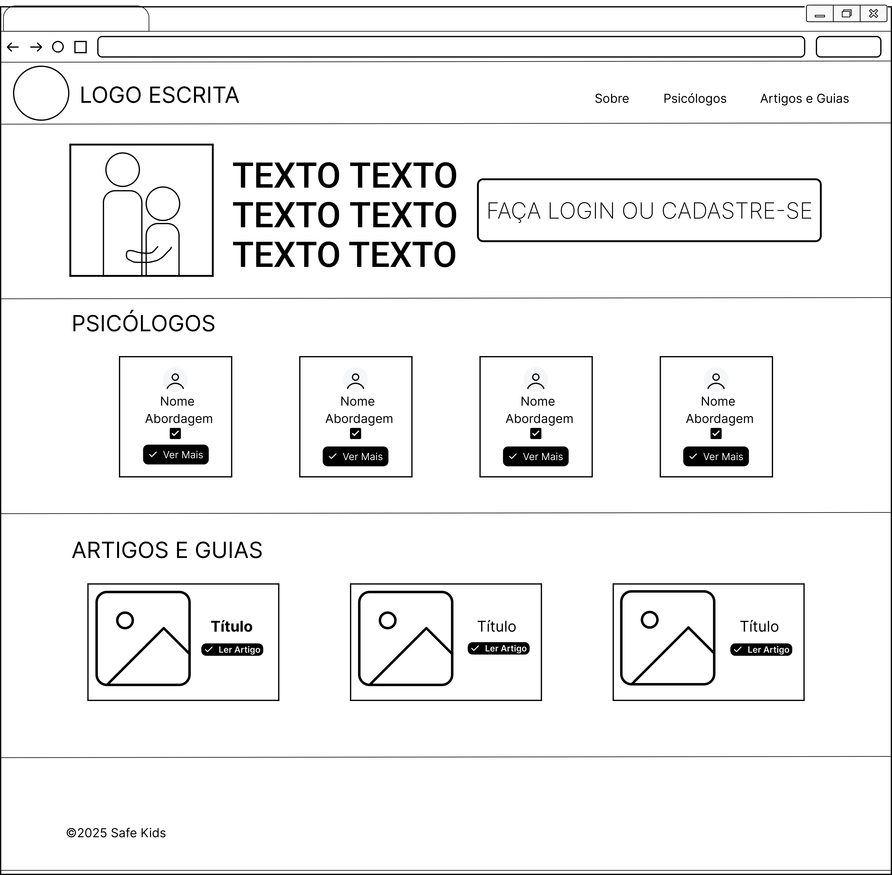  

### User Flow  

O user flow ilustra desde o contato com o site até o agendamento com psicólogo e posterior acompanhamento do caso.  

  

### Protótipo Interativo  

✅ [Protótipo Interativo (Figma)](https://www.figma.com/proto/3SYsKkHnHZ9cZ0sNnGodzd/Prot%C3%B3tipo-Interativo-SafeKids?node-id=0-1&t=Zl7sHYrYl3zVqDSn-1)  

---

# Metodologia  

A equipe organizou o trabalho combinando princípios de Design Thinking, desenvolvimento incremental e colaboração remota. O processo foi iterativo, passando por ciclos de entendimento do problema, ideação, prototipação e implementação, em linha com práticas do método Scrum.

## Ferramentas  

| Ambiente                     | Plataforma | Link de acesso                                                                                                                                                                                                 |
|-----------------------------|-----------|---------------------------------------------------------------------------------------------------------------------------------------------------------------------------------------------------------------|
| Processo de Design Thinking | Miro      | https://miro.com/welcomeonboard/amlaYk5CM0NXRkdMVkZQN05yZ3ltdlU1L0puMEYzMk0wWTBLbjdDaFlTUkxGZGl3SExnR2xqSWg2dGNuQlJaZ3o5VmpnRFBaejFQYThwVEZHT1pCTm1sdW5ZM0NoQ21DNUtndld1bU9hQnZleWpxRWplSTNGL1NtbU9vZ2lUYUJ3VHhHVHd5UWtSM1BidUtUYmxycDRnPT0hdjE=?share_link_id=614248561530 |
| Repositório de código       | GitHub    | https://github.com/ICEI-PUC-Minas-PPLES-TI/plf-es-2025-2-ti1-5538100-safe-kids                                                                                                                               |
| Protótipo Interativo        | Figma     | https://www.figma.com/design/3SYsKkHnHZ9cZ0sNnGodzd/Prot%C3%B3tipo-Interativo-SafeKids?node-id=0-1&t=Fyrl4F9YajAlWfPG-1                                                                                      |
| Wireframe                   | Figma     | https://www.figma.com/design/BYKI7ITEfxpb1Ni1sio4Na/WIREFRAMES?node-id=0-1&t=vYOvbsZKZ5aLp02Q-1                                                                                                              |
| User Flow                   | Figma     | https://www.figma.com/design/LY2WoZs92lAha6vkyrYMKs/User-Flow?node-id=0-1&t=vRUqBk1ermSCfq8m-1                                                                                                               |
| Gerenciamento               | Trello    | https://trello.com/invite/b/690b65776a138bc62eafa40a/ATTI54ec4af67ae97ce029c0b9cd47e6ad3f164E5D5E/tiaw-safekids                                                                                              |

## Gerenciamento do Projeto  

O gerenciamento de tarefas foi feito por meio de um quadro Kanban na plataforma Trello, com colunas como “Backlog”, “Em andamento”, “Em revisão” e “Concluído”. Isso permitiu visualizar claramente o fluxo de trabalho, evitar gargalos e distribuir as atividades conforme a afinidade técnica de cada integrante.  

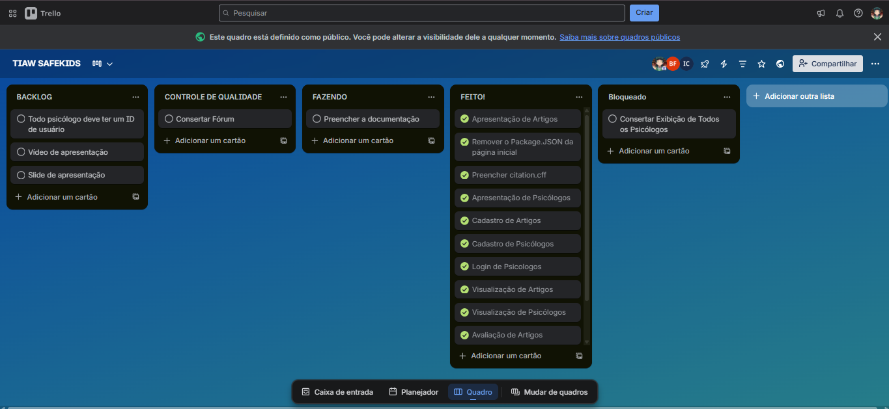  

---

# Solução Implementada  

A solução SafeKids foi implementada como uma aplicação web responsiva, com frontend em HTML, CSS e JavaScript e backend mockado em JSON Server, hospedado juntamente com o site. O foco foi viabilizar um protótipo funcional que demonstre, de forma realista, as principais jornadas de usuários mapeadas no Product Discovery.  

## Vídeo do Projeto  

O vídeo apresenta o problema, a narrativa da solução e uma demonstração das principais funcionalidades do sistema. 

🖥️ [Vídeo do projeto](https://youtu.be/M4r-swanPhs)  
  

## Funcionalidades  

### Lista de Psicólogos e Perfil Detalhado  

**Descrição:**  
Permite que qualquer usuário (logado ou não) visualize uma lista de psicólogos com foto, nome, especialidades, cidade, valor da consulta, tipo de atendimento (online/presencial/ambos) e média de avaliação. Ao clicar em “Ver Perfil”, o usuário acessa a página detalhada daquele profissional, com biografia, formação, especialidades, avaliações e agenda de horários.  

**Estruturas de dados associadas:**  

- `psicologos`  
- `avaliacoes`  
- `horariosDisponiveis`  

**Instruções de acesso:**  

- Acessar a página inicial do SafeKids.  
- Rolar até a seção de psicólogos ou clicar em **“Ver todos os psicólogos”**.  
- Clicar em **“Ver Perfil”** em qualquer card para abrir a página do profissional.

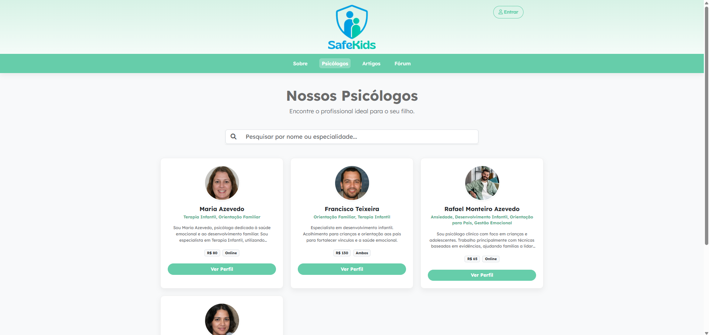  
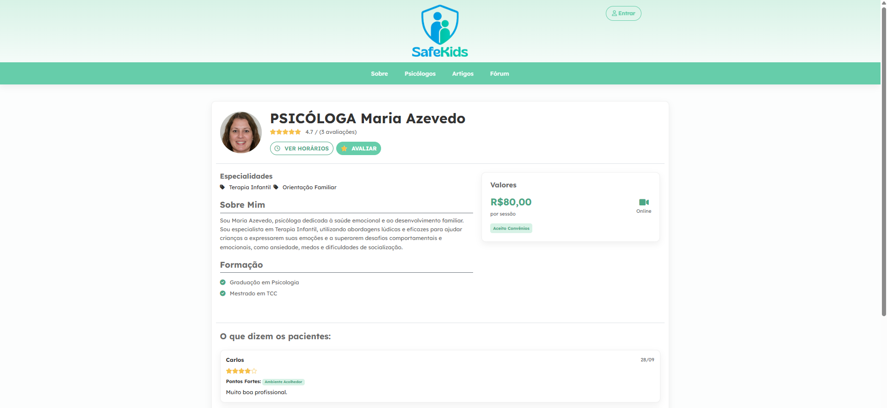    

---

### Agendamento de Consulta  

**Descrição:**  
Pais e responsáveis logados podem visualizar os horários disponíveis de um psicólogo e agendar atendimentos em datas e horários específicos.  

**Estruturas de dados associadas:**  

- `psicologos`  
- `horariosDisponiveis`  
- `agendamentos`  

**Instruções de acesso:**  

- Fazer login como pai/responsável.  
- Acessar a página de perfil de um psicólogo.  
- Clicar em **“Ver horários disponíveis”**, escolher data e horário.  
- Confirmar o agendamento no modal apresentado.  

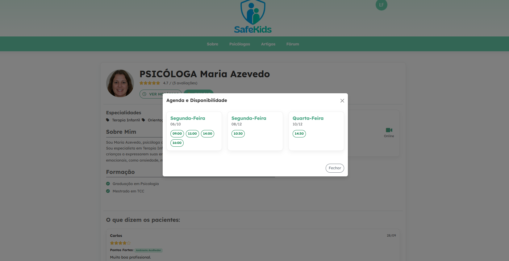 
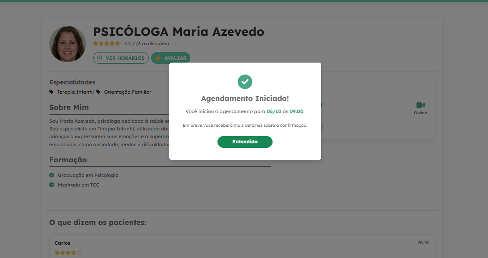 

---

### Área de Artigos e Guias  

**Descrição:**  
A área de artigos disponibiliza conteúdos educativos, guias e orientações escritos por psicólogos, voltados a temas como: “Como conversar com as crianças sobre o que veem online”, “Impacto da exposição precoce à tecnologia” e “Rotina digital saudável”. Esses textos funcionam como estratégia de psicoeducação para pais e responsáveis (PAIVA; COSTA, 2015; JEFF ORLOWSKI et al., 2020).  

**Estruturas de dados associadas:**  

- `artigos`  

**Instruções de acesso:**  

- Acessar a seção de artigos no site.  
- Utilizar filtros de busca por título, autor ou data.  
- Clicar em **“Ler artigo”** para acessar a página individual.  

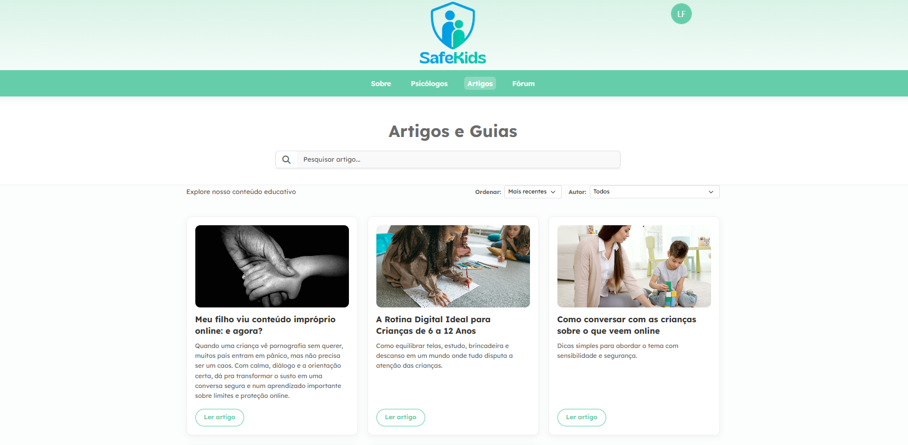

---

### Avaliação de Artigos  

**Descrição:**  
Usuários logados podem avaliar artigos com base em critérios como relevância, clareza e qualidade do conteúdo. Isso gera uma média de avaliação exibida na listagem e incentiva a produção de material cada vez mais útil e alinhado às necessidades das famílias.  

**Estruturas de dados associadas:**  

- `artigos` (campo `avaliacoes`)  
- `avaliacoes` (estrutura detalhada de avaliação de qualidade)  

**Instruções de acesso:**  

- Acessar a página de um artigo.  
- Preencher o formulário de avaliação disponível (quando houver).  

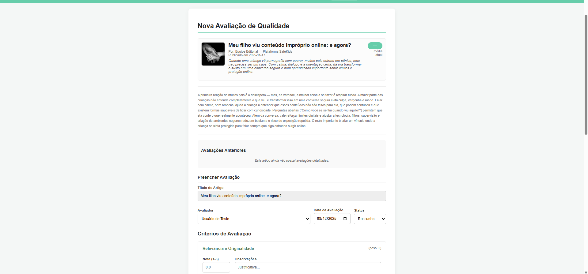
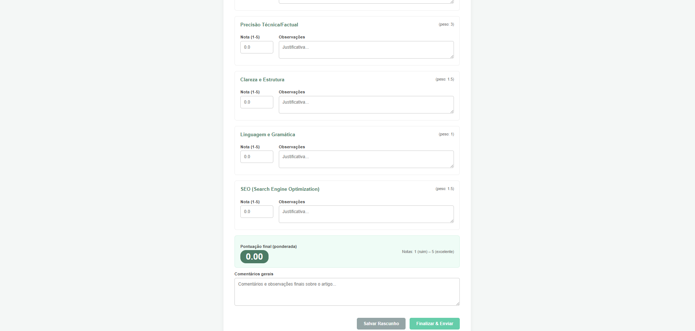

---

### Comentários em Artigos  

**Descrição:**  
Usuários logados podem comentar em artigos para compartilhar experiências, dúvidas ou reflexões. Isso fortalece a sensação de comunidade e permite que pais aprendam uns com os outros (PAIVA; COSTA, 2015).  

**Estruturas de dados associadas:**  

- `artigos` (campo `comentarios`)  

**Instruções de acesso:**  

- Acessar um artigo.  
- Preencher o campo de comentário e enviar.  

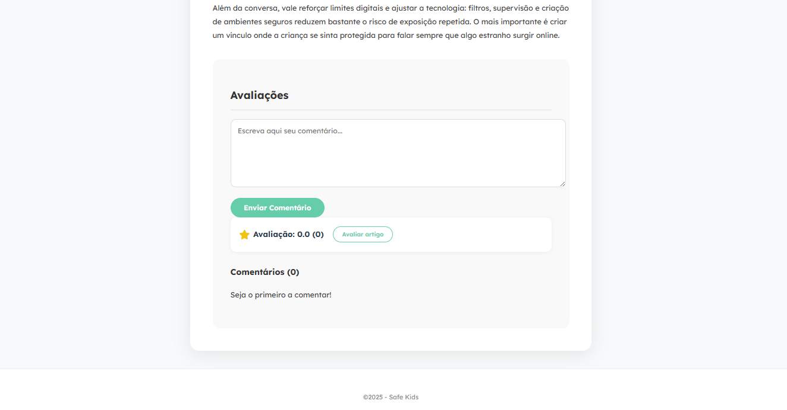

---

### Fórum Anônimo para Pais  

**Descrição:**  
O fórum funciona como um mural de conversas anônimas, onde pais e responsáveis podem compartilhar situações delicadas, pedir conselhos e oferecer apoio a outras famílias. Os nomes reais não aparecem, apenas a indicação de “Anônimo”, para reduzir vergonha e medo de julgamento.  

**Estruturas de dados associadas:**  

- `posts` (tópicos do mural)  
- `comentarios` (respostas a cada tópico)  

**Instruções de acesso:**  

- Acessar o menu **“Fórum”**.  
- Visualizar a lista de relatos já publicados.  
- Para criar um novo tópico, é necessário estar logado como pai/responsável.  
- Preencher título e texto do relato e confirmar.  
- Para responder, digitar uma mensagem de apoio no campo abaixo de cada post.  

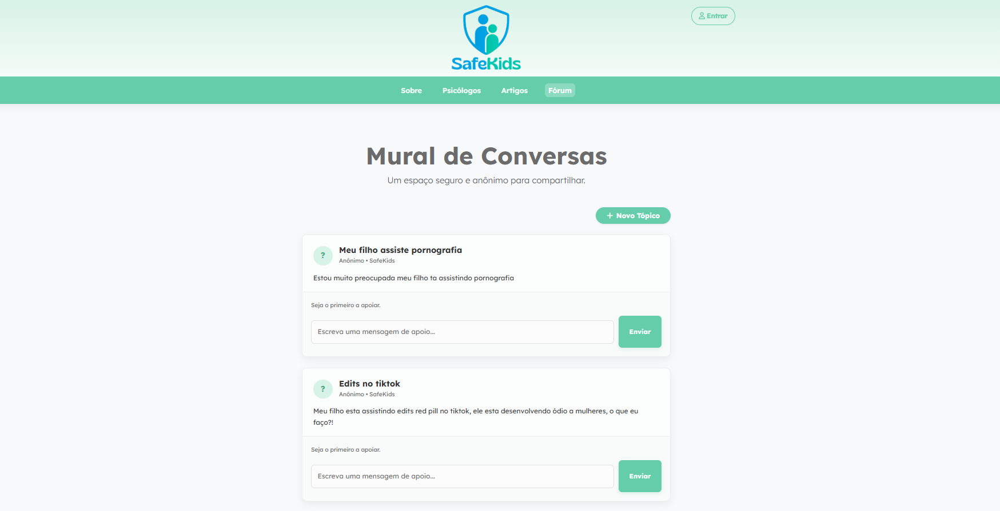

---

### Cadastro e Login (Pais/Responsáveis e Psicólogos)  

**Descrição:**  

O sistema oferece fluxos de login distintos para:

- **Pais/Responsáveis:** acessam agenda, comentários, avaliações e fórum.  
- **Psicólogos:** gerenciam perfil público, agenda de horários disponíveis e acompanham agendamentos com pacientes.  

O login é simulado via JSON Server, com validação de e-mail e senha em coleções diferentes (`usuarios` e `psicologos`).  

**Estruturas de dados associadas:**  

- `usuarios`  
- `psicologos`  

**Instruções de acesso:**  

- Acessar a página de login.  
- Selecionar o tipo de acesso (pai/responsável ou psicólogo).  
- Informar e-mail e senha cadastrados no `db.json`.  
- Após login bem-sucedido, o usuário é redirecionado para a página inicial, e o cabeçalho passa a exibir o menu de usuário (foto, nome, botão **“Minha Agenda”** e **“Sair”**).  

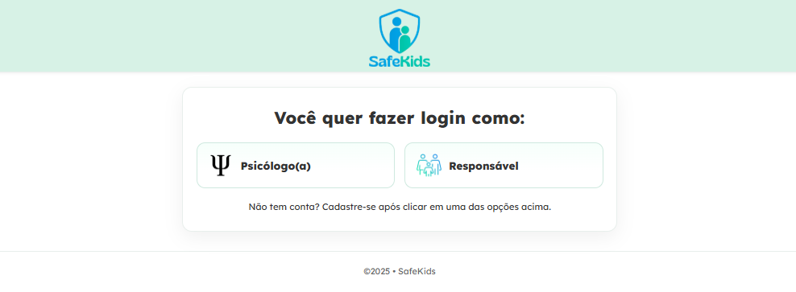

---

### Edição de Perfil e Gestão de Agenda do Psicólogo  

#### Perfil do Psicólogo  

**Descrição:**  
Psicólogos logados podem editar seus dados públicos, como nome, valor da consulta, cidade, foto, biografia, formação e especialidades. Essas informações são refletidas diretamente no card da listagem e no perfil detalhado.  

**Estruturas de dados associadas:**  

- `psicologos`  

**Instruções de acesso:**  

- Fazer login como psicólogo.  
- Acessar **“Gerenciar Perfil”** no menu do usuário.  
- Alterar os campos desejados e salvar.  

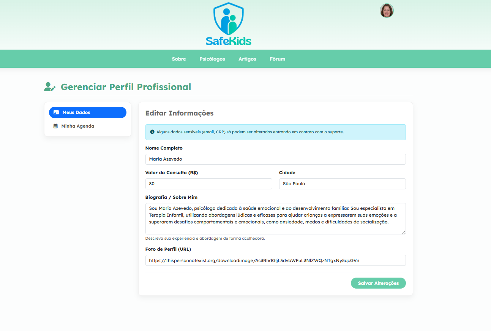

#### Agenda de Horários  

**Descrição:**  
No mesmo painel, o psicólogo gerencia sua agenda, cadastrando horários disponíveis por data. Ao criar ou remover slots, a página de perfil passa a exibir esses horários para agendamento pelos pais.  

**Estruturas de dados associadas:**  

- `horariosDisponiveis` (data + lista de horários por psicólogo)  

**Instruções de acesso:**  

- Estar logado como psicólogo.  
- Acessar **“Gerenciar Perfil” → seção de Agenda**.  
- Selecionar uma data, adicionar ou remover horários.  
- As mudanças são salvas no JSON Server e ficam imediatamente visíveis para os pais na tela de perfil do psicólogo.  

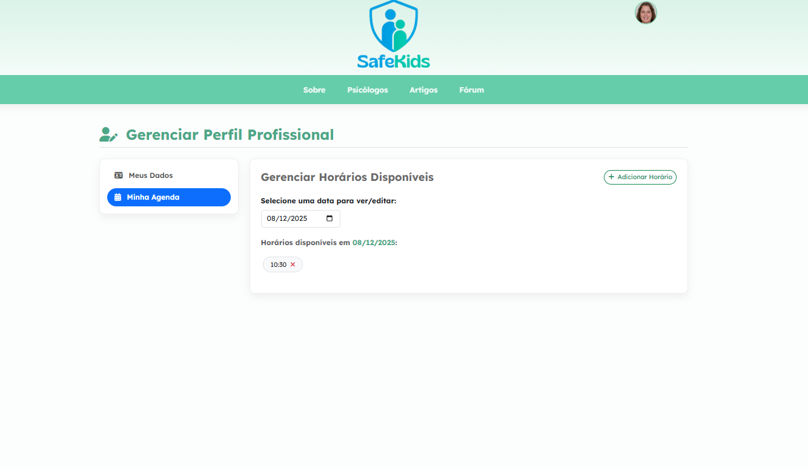

---

### Painel “Minha Agenda” (Visão do Paciente e do Psicólogo)  

**Descrição:**  
A página de agenda exibe os agendamentos já criados, com visão adaptada ao tipo de usuário:

- **Pais/Responsáveis:** veem os atendimentos marcados com cada psicólogo, podendo cancelar uma consulta futura.  
- **Psicólogos:** veem a lista de pacientes agendados por data e horário, também com possibilidade de cancelar.  

**Estruturas de dados associadas:**  

- `agendamentos`  
- `usuarios`  
- `psicologos`  

**Instruções de acesso:**  

- Estar logado.  
- Clicar em **“Minha Agenda”** no menu superior.  
- Visualizar cartões com data, horário, status e, conforme o tipo de usuário, nome do psicólogo ou do paciente.  
- Utilizar o botão **“Cancelar”** para remover um agendamento.  

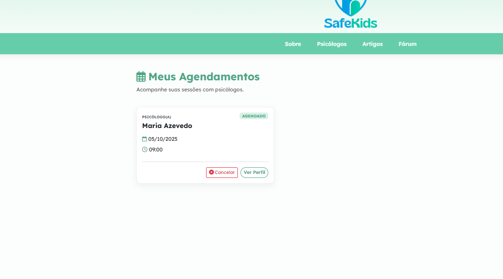
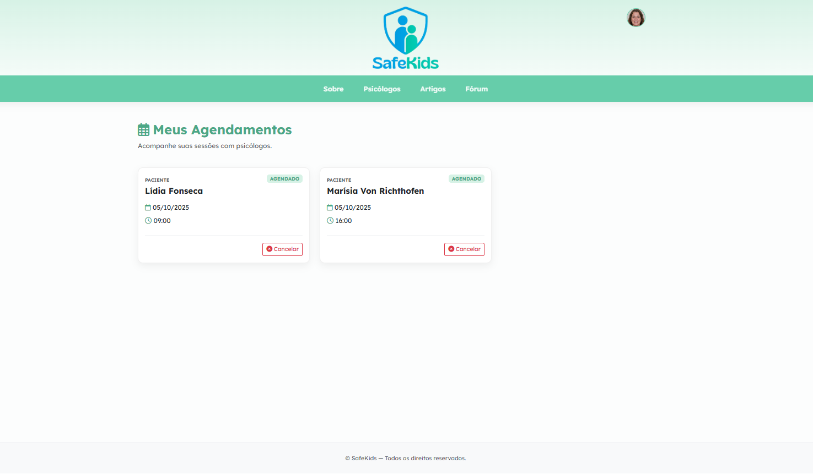

---

### Avaliação de Psicólogos  

**Descrição:**  
Além da avaliação de artigos, os psicólogos também recebem avaliações numéricas e comentários. Isso gera uma média exibida tanto na home quanto no perfil, ajudando outros pais a escolherem um profissional de confiança.  

**Estruturas de dados associadas:**  

- `avaliacoes` (associadas a `psicologos` via `psicologoId`)  

**Instruções de acesso:**  

- Estar logado como pai/responsável.  
- Acessar o perfil de um psicólogo após uma experiência de atendimento.  
- Utilizar a opção de avaliação (quando disponível) para registrar nota e comentário.  

A média é recalculada automaticamente, e as estrelas são atualizadas tanto nos cards quanto no perfil completo.  

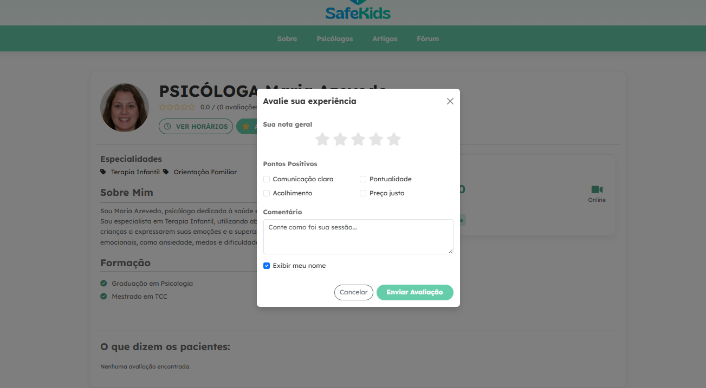

---

### Responsividade e Acessibilidade  

**Descrição:**  
A interface foi construída com foco em responsividade e uso real em dispositivos móveis, já que muitos pais acessam a internet pelo celular. Foram adotadas boas práticas de CSS e HTML semântico para tornar o site mais acessível.  

**Principais cuidados adotados:**  

- Layout fluido com **Flexbox** e **CSS Grid**, adaptando colunas de cards e seções ao tamanho da tela.  
- Tipografia com bom contraste entre fundo e texto, facilitando leitura em celulares com brilho reduzido.  
- Botões e áreas clicáveis com tamanho mínimo adequado ao toque.  
- Uso de `aria-label` e textos alternativos em imagens importantes, favorecendo tecnologias assistivas.  
- Linguagem acolhedora, direta e sem jargão muito técnico, respeitando o contexto sensível do tema.  

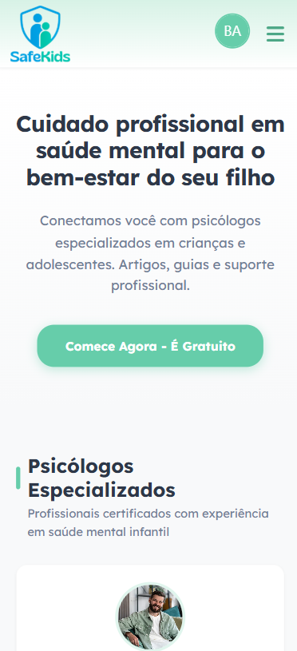

---

### Arquitetura da Solução  

A solução é composta por:  

- **Frontend:** HTML, CSS e JavaScript puro, organizado em módulos (páginas) dentro da pasta `modulos/`.  

- **Backend simulado:** arquivo `db.json` com as seguintes entidades:  
  - `usuarios` – pais/responsáveis;  
  - `psicologos` – profissionais de psicologia cadastrados;  
  - `artigos` – conteúdos educativos;  
  - `avaliacoes` – avaliações de artigos e psicólogos (conforme contexto);  
  - `posts` e `comentarios` – dados do fórum;  
  - `horariosDisponiveis` – horários abertos na agenda dos psicólogos;  
  - `agendamentos` – consultas marcadas entre pais e psicólogos.  

A comunicação é feita via requisições HTTP (`fetch`) para o JSON Server, hospedado junto ao site (Render), simulando um backend REST. As rotas seguem o padrão `/recurso`, com filtros usando query string (`?campo=valor`, `_sort`, `_order`, `_embed`, etc.).  

---

### Como Executar o Projeto Localmente  

Para fins de desenvolvimento e demonstração offline, o projeto pode ser executado localmente utilizando **Node.js** e **JSON Server**.  

1. **Clonar o repositório:**  

   ```bash
   git clone https://github.com/ICEI-PUC-Minas-PPLES-TI/plf-es-2025-2-ti1-5538100-safe-kids.git
   ```

2. **Instalar dependências (JSON Server):**

    ```bash
    npm install
    ```

3. **Subir o JSON Server:**

     ```bash
    npx json-server --watch db.json --port 3000
     ```

4. **Abrir o frontend:**

  - Abrir o arquivo index.html com a extensão Live Server do VS Code, ou servir a pasta via um servidor estático simples, como:

    ```bash
    npx serve .
    ```

## Referências Bibliográficas

_ARAÚJO, L. et al._ **Pornografia e compulsão sexual: impactos na saúde mental de adolescentes.** Revista Brasileira de Sexualidade Humana, 2023.

_FROTA D’ABREU, J._ **Pornografia, dependência e comportamento sexual compulsivo.** São Paulo: Casa do Psicólogo, 2015.

_JEFF ORLOWSKI et al._ **The Social Dilemma (O Dilema das Redes).** Documentário, Netflix, 2020.

_ONU – Organização das Nações Unidas._ **Relatório sobre a Situação da Banda Larga 2022.** Disponível em: https://www.itu.int
. Acesso em: 2025.

_PAIVA, V.; COSTA, A. M._ **Sexualidade, mídia e adolescência: desafios para a educação em saúde.** Cadernos de Saúde Pública, v. 31, n. 3, 2015.

_TARDIF, M. et al._ **Adolescentes autores de abuso sexual: história de vida, aprendizagem e violência.** Psicologia em Estudo, v. 20, n. 4, 2015.